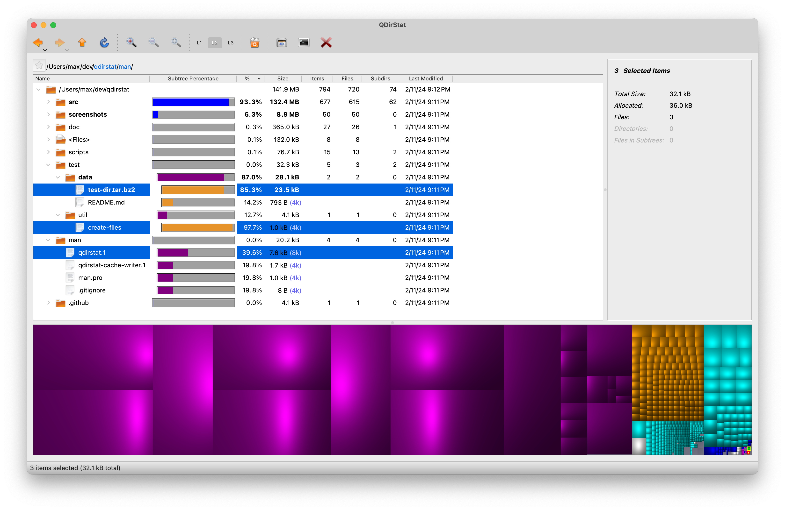

# QDirStat for macOS

Qt-based directory statistics: KDirStat without any KDE -- from the author of
the original KDirStat [Stefan Hundhammer](Stefan.Hundhammer@gmx.de).

macOS builds notarized by [Jesus Herrera Arroyo](me@jesusarroyo.com)

This repo only provides macOS builds. For the original repo, please refer to: https://github.com/shundhammer/qdirstat

## Screenshot

## Overview

QDirStat is a graphical application to show where your disk space has gone and
to help you to clean it up.

It shows the total size of directories and of their files both in a traditional
tree view and in a colored treemap graphics where a large
file is shown as a large rectangle, and small files are shown as small
rectangles. Click on it, and you will see where in the tree the file is, and
you can instantly move it to the trash if you like. The color corresponds to
the file type: Images, videos or whatever.